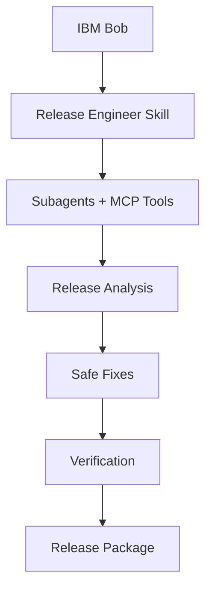

# BobShip

## From "Works on My Machine" to "Ready to Ship"

BobShip is an AI release-engineering workflow built around IBM Bob.

It analyzes a software repository across:

- Testing
- Security
- API contracts
- Deployment
- Environment configuration
- Documentation
- Dependencies

Bob coordinates specialized subagents and deterministic MCP tools, identifies release blockers, safely fixes issues, verifies the changes and generates a release-readiness package.

## Architecture



## Dashboard

[`dashboard/release-dashboard.html`](dashboard/release-dashboard.html) is a self-contained, zero-dependency HTML dashboard for visualising the output of BobShip's `release_snapshot` MCP tool.

**How to use:**

1. Open `dashboard/release-dashboard.html` directly in any browser (no server needed).
2. Click **Load report** in the top-right corner.
3. Paste the JSON that Bob prints after calling `release_snapshot`, then click **Render**.

The dashboard renders:

- **Readiness score** — a 0–100 score with a pass/warn/blocked status label
- **Severity breakdown** — filterable chips for critical / high / medium / low / info
- **Findings table** — each finding's severity, status, category, file location, and message

**Before/after comparison:**

To compare two runs, paste a JSON object with a `"before"` and `"after"` key, each containing a full snapshot:

```json
{
  "before": { ...first release_snapshot output... },
  "after":  { ...second release_snapshot output... }
}
```

The dashboard will display both scores side-by-side with a delta, and the findings table will reflect the `after` snapshot.

Click **Load sample** to see a worked example without needing a live MCP call.
